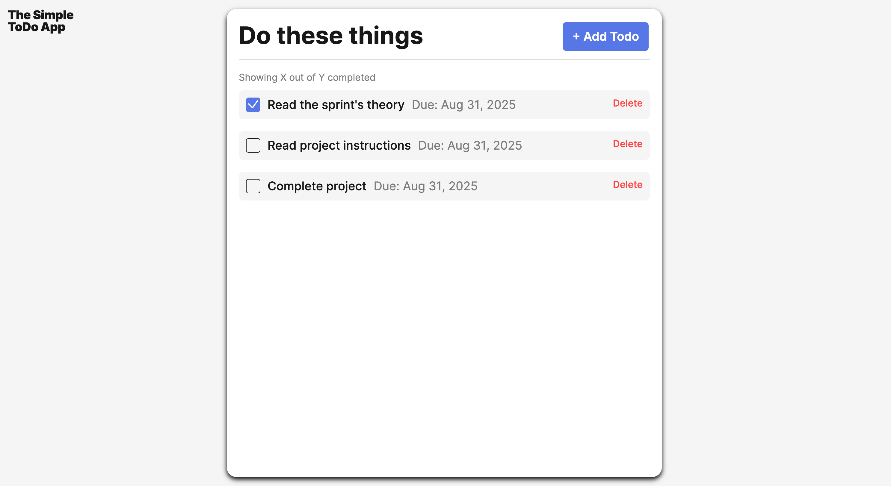
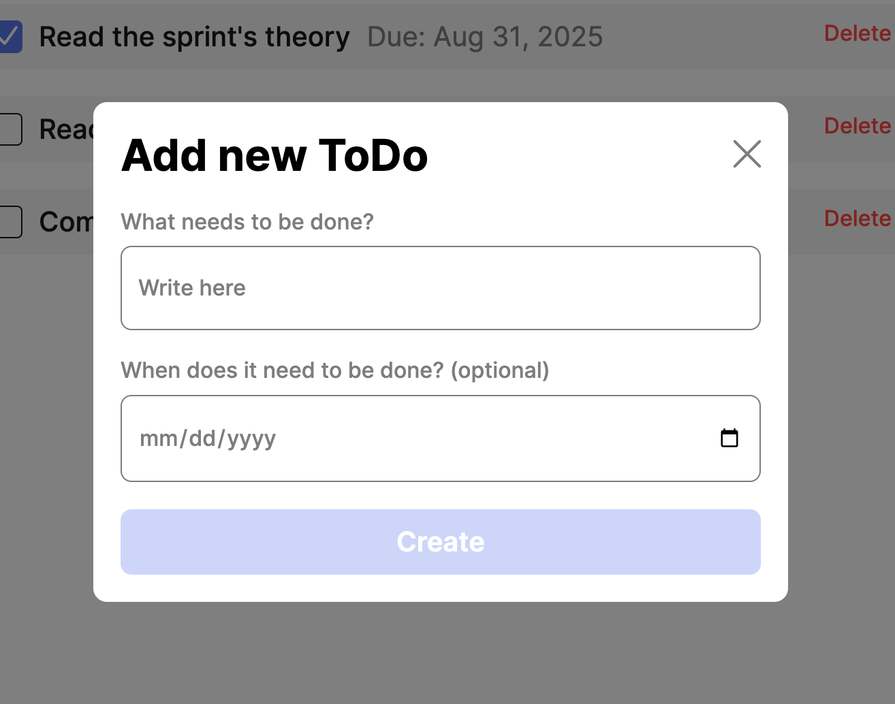

# Simple Todo App

An interactive to-do list application built with JavaScript and refactored using Object-Oriented Programming principles. Users can add tasks, optionally assign due dates, mark them as complete, and delete them when finished.

## Functionality

- Add new to-do items with a name and optional due date
- Automatically generates unique IDs for each to-do (using `uuid`)
- Mark tasks as complete via checkboxes
- Delete tasks individually
- Form validation ensures required fields are filled correctly
- Popup form resets after successful submission (but retains data if closed without submitting)

## Technology

- **HTML5** for structure
- **CSS** for styling and responsive layout
- **JavaScript** for functionality and DOM manipulation
- **OOP** design patterns (`Todo` and `FormValidator` classes) for cleaner, modular code
- **uuid v4** for generating unique identifiers
- **GitHub Pages** for deployment

## Screenshots

## Deployment

This project is deployed on GitHub Pages:

[View Live Demo](https://joyce1312.github.io/se_project_todo-app/)
